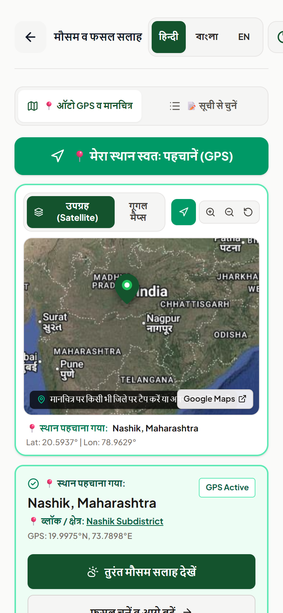
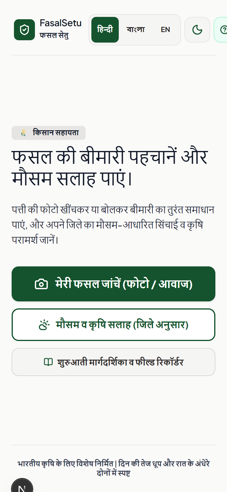
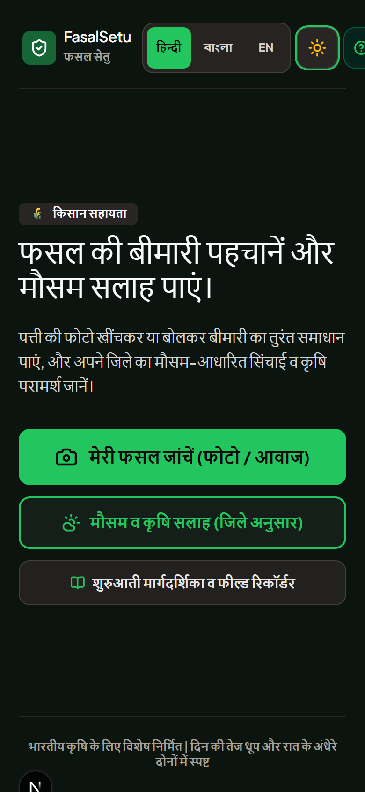
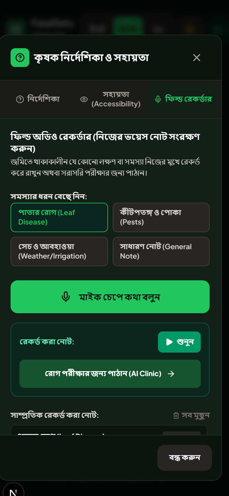
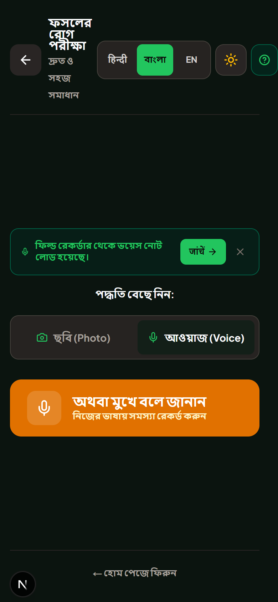
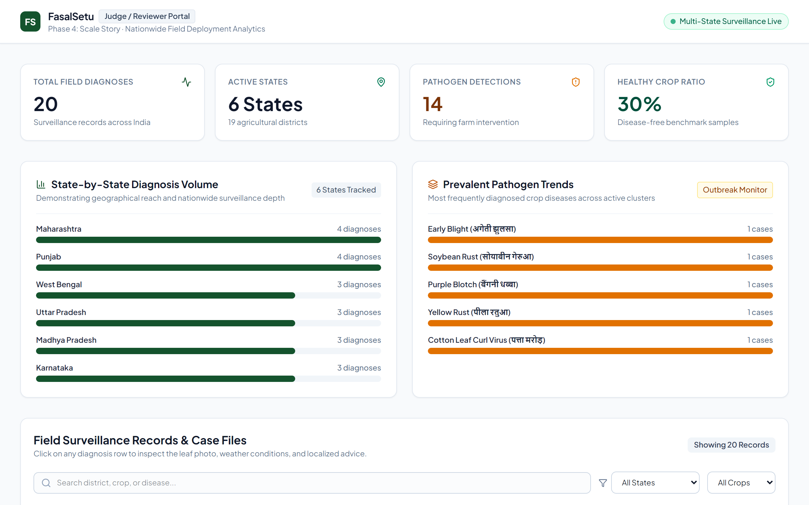
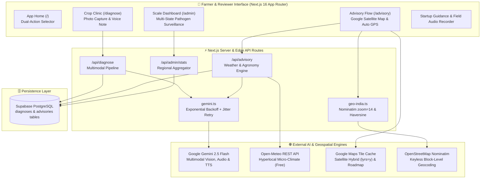

<div align="center">

# 🌾 FasalSetu (फसल सेतु)
### Bridging Indian Farmers to Real-Time Multimodal AI Diagnostics & Hyperlocal Climate Intelligence

[](https://nextjs.org/)
[](https://aistudio.google.com/)
[](https://supabase.com/)
[](https://leafletjs.com/)
[](https://tailwindcss.com/)
[](https://fasalsetu-theta.vercel.app)

<br />

[**🚀 Live Production Demo**](https://fasalsetu-theta.vercel.app) •
[**🌱 Crop Clinic**](https://fasalsetu-theta.vercel.app/diagnose) •
[**🛰️ Satellite Advisory**](https://fasalsetu-theta.vercel.app/advisory) •
[**📊 Reviewer Dashboard**](https://fasalsetu-theta.vercel.app/admin)

<br />

<p align="center">
  
</p>

</div>

---

## 📌 Executive Summary

Smallholder farmers across India face devastating crop losses due to late pest identification, unpredictable weather shifts, and generic advisories disconnected from village realities. Most existing digital ag-tech platforms fail because they require typing, lack authentic vernacular voice, or demand paid subscriptions.

**FasalSetu (फसल सेतु)** is a zero-friction, production-grade agricultural AI clinic engineered from the ground up for Indian farmers:
- 🌿 **Multimodal Vision & Voice Diagnosis**: Farmers snap a leaf photo or hold a voice button describing symptoms. Powered by **Google Gemini 2.5 Flash**, it diagnoses fungal blights, viral curled foliage, rusts, or confirms healthy crops in under 2 seconds.
- 🗣️ **100% Vernacular Fluency**: Full interface and native two-way audio synthesis in **Hindi (`हिन्दी`)**, **Bengali (`বাংলা`)**, and **English (`EN`)** without robotic text-to-speech.
- 🛰️ **Realistic Google Satellite Farm Mapping**: Real high-resolution Google Satellite Hybrid & Roadmap tiles with interactive farm pinning, coordinate locking, and direct Google Maps linking.
- 📍 **Block-Level Auto GPS Detection**: Reverse geocodes down to the exact subdistrict, tehsil, and village level using OpenStreetMap Nominatim.
- 🌦️ **Micro-Climate Field Advisory**: Real-time 7-day agro-meteorological forecasting from Open-Meteo matching exact farm GPS coordinates.
- 📊 **National Scale & Surveillance Command Center (`/admin`)**: A dedicated agronomist/judge surface visualizing crop health across 6 states (*Maharashtra, Punjab, West Bengal, Uttar Pradesh, Madhya Pradesh, Karnataka*) with drill-down disease case files.
- 🛡️ **Zero GCP Billing Friction**: 100% compliant with strict zero-cost hackathon constraints — zero Firebase, zero Vertex AI, zero Cloud STT/TTS fees.

---

## 📸 Visual Showcase

<div align="center">
<table>
  <tr>
    <td width="50%" align="center">
      <b>☀️ Sunlight-Optimized Light Mode</b><br/>
      
    </td>
    <td width="50%" align="center">
      <b>🌙 Forest Midnight Dark Mode</b><br/>
      
    </td>
  </tr>
  <tr>
    <td width="50%" align="center">
      <b>🎙️ Field Audio Recorder & Guidance</b><br/>
      
    </td>
    <td width="50%" align="center">
      <b>🔬 Multimodal Crop Clinic (/diagnose)</b><br/>
      
    </td>
  </tr>
  <tr>
    <td colspan="2" align="center">
      <b>📊 Reviewer & Agronomist Surveillance Command Center (/admin)</b><br/>
      
    </td>
  </tr>
</table>
</div>

---

## 🏗️ System Architecture



---

## 🌟 Key Features & Capabilities

### 1. Multimodal AI Crop Clinic (`/diagnose`)
- **Visual Pest & Disease Detection**: Takes raw leaf photos directly from mobile camera or file upload. Diagnoses bacterial blights, fungal rusts, downy mildew, leaf curl viruses, nutrient deficiencies, or healthy vigor.
- **Native Audio Note Understanding**: Farmers can press and record voice descriptions in their native dialect (e.g., *"मेरे टमाटर के पत्ते पीले पड़ रहे हैं और काले धब्बे दिख रहे हैं"*). Gemini 2.5 Flash processes the audio directly without a third-party speech-to-text intermediary.
- **Spoken Audio Prescription**: Automatically speaks the clinical diagnosis and remedy recommendations in natural native audio using Gemini's multi-speaker synthesis.
- **Resilient Retry Wrapper**: Every Gemini API call runs through a 3-attempt exponential backoff with jitter (`callWithRetry`), absorbing sudden network fluctuations and burst traffic.

### 2. Realistic Google Satellite Map & Auto GPS (`/advisory`)
- **Google Satellite Hybrid Layer**: Realistic satellite imagery with road network overlays (`https://mt1.google.com/vt/lyrs=y`) and vector roadmap (`https://mt1.google.com/vt/lyrs=m`).
- **Draggable Agricultural Pin**: Drag and drop the pin anywhere on fields with live coordinate resolution.
- **1-Tap GPS Auto Detection**: Browser Geolocation API locks GPS coordinates with an animated fly-to camera motion (`map.flyTo([lat, lon], 14)`).
- **Subdistrict / Block Accuracy**: Reverse geocodes coordinates via OpenStreetMap Nominatim `jsonv2` at `zoom=14` to reliably identify villages, blocks, tehsils, districts, and states without artificial snapping errors.
- **Instant Google Maps Redirection**: 1-click button (`📍 Google Maps में खोलें`) opens the farm pin directly in native Google Maps.

### 3. Hyperlocal Microclimate Agronomy
- Fetches real-time temperature, relative humidity, wind speed, precipitation, and rain probability from Open-Meteo for the farmer's exact latitude and longitude.
- Gemini 2.5 Flash synthesizes weather data with crop-specific agronomic science to provide tailored irrigation, pesticide spraying, and harvest advisories.

### 4. Judge & Agronomist Command Center (`/admin`)
- **Demonstrating National Reach**: Live telemetry spanning 6 major agricultural states (*Maharashtra, Punjab, West Bengal, Uttar Pradesh, Madhya Pradesh, Karnataka*).
- **Disease Surveillance Heatmap**: Live pathogen distribution breakdowns (Early Blight, Rust, Late Blight, Cotton Leaf Curl Virus, Yellow Mosaic).
- **State Filtering & Case File Drill-Down**: Click any surveillance record to open a full modal containing the original field leaf photo, weather conditions, disease classification, and treatment plan.

### 5. Rural Accessibility & Design System
- **Forest Midnight Dark Mode**: Designed for night-time field usage with eye-friendly forest blacks (`#0b140f`), deep foliage cards (`#131f18`), and emerald accents (`#22c55e`). Zero screen flash during hydration.
- **Contrast Floor**: High-contrast ratios (&ge; 4.5:1 for body copy; &ge; 7:1 for headings) ensuring readability under harsh midday sunlight.
- **Large Touch Targets**: Minimum 44&times;44pt tap targets across all interactive buttons and language selectors.
- **Field Audio Recorder Modal**: Built-in recorder allowing farmers to log audio notes across categories (*Leaf Spots, Pests, Irrigation, Growth*) and dispatch them directly to the AI Clinic with one tap.

---

## 🛠️ Technology Stack

| Layer | Technology | Rationale |
|---|---|---|
| **Framework** | [Next.js 16.3.4](https://nextjs.org/) (App Router, Turbopack) | Server components, edge API routes, fast SSR, zero-config Vercel deployment. |
| **Language** | [TypeScript](https://www.typescriptlang.org/) | End-to-end type safety across API routes, database schemas, and components. |
| **AI / Multimodal** | [`@google/genai` (v2.21.0)](https://www.npmjs.com/package/@google/genai) | Official Google GenAI SDK accessing **Gemini 2.5 Flash** for vision, audio comprehension, and speech generation. |
| **Styling** | [Tailwind CSS v4](https://tailwindcss.com/) | Modern CSS-variable tokens, `@custom-variant dark`, high-contrast accessible palettes. |
| **Mapping Engine** | [Leaflet](https://leafletjs.com/) + Google Raster Tiles | Lightweight interactive satellite mapping with zero billing accounts or GCP quotas. |
| **Geocoding** | [OpenStreetMap Nominatim](https://nominatim.org/) + BigDataCloud | Free, keyless reverse geocoding resolving accurate Indian subdistricts/blocks. |
| **Weather API** | [Open-Meteo REST API](https://open-meteo.com/) | Hyperlocal, keyless, zero-cost weather forecasts with hourly precipitation and humidity. |
| **Database** | [Supabase](https://supabase.com/) (PostgreSQL + RLS) | Managed Postgres with Row Level Security, instant REST APIs, and migration tools. |
| **Icons** | [Lucide React](https://lucide.dev/) | Consistent, clean 2px line icons adhering to design language constraints. |

---

## 🚀 Quick Start Guide

### Prerequisites
- **Node.js**: `v20.x` or later
- **npm** or **pnpm**
- A free **Google Gemini API Key** from [Google AI Studio](https://aistudio.google.com/app/apikey)
- A free **Supabase** project from [Supabase](https://supabase.com/)

### 1. Clone the Repository
```bash
git clone https://github.com/ogMaverick12/fasalsetu.git
cd fasalsetu
```

### 2. Install Dependencies
```bash
npm install
```

### 3. Configure Environment Variables
Create a `.env.local` file in the project root:

```env
# Google AI Studio Gemini API Key (Required for AI Clinic & Advisory)
GEMINI_API_KEY="your-gemini-api-key-here"

# Supabase Credentials (Optional for local fallback, required for live database sync)
NEXT_PUBLIC_SUPABASE_URL="https://your-project.supabase.co"
NEXT_PUBLIC_SUPABASE_ANON_KEY="your-supabase-anon-key-here"
```

### 4. Run the Development Server
```bash
npm run dev
```

Open [http://localhost:3000](http://localhost:3000) in your browser.

---

## 🗄️ Database Setup (Supabase)

To enable live cloud storage and the Reviewer Dashboard (`/admin`), execute the following SQL in your **Supabase SQL Editor**:

```sql
-- 1. Create diagnoses table
CREATE TABLE IF NOT EXISTS public.diagnoses (
    id UUID PRIMARY KEY DEFAULT gen_random_uuid(),
    created_at TIMESTAMPTZ NOT NULL DEFAULT timezone('utc'::text, now()),
    image_url TEXT,
    crop_type TEXT,
    diagnosis_text TEXT,
    state TEXT,
    language TEXT NOT NULL DEFAULT 'en'
);

ALTER TABLE public.diagnoses ENABLE ROW LEVEL SECURITY;
CREATE POLICY "Allow public insert to diagnoses" ON public.diagnoses FOR INSERT WITH CHECK (true);
CREATE POLICY "Allow public select on diagnoses" ON public.diagnoses FOR SELECT USING (true);
CREATE INDEX IF NOT EXISTS idx_diagnoses_state ON public.diagnoses(state);
CREATE INDEX IF NOT EXISTS idx_diagnoses_created_at ON public.diagnoses(created_at DESC);

-- 2. Create advisories table
CREATE TABLE IF NOT EXISTS public.advisories (
    id UUID PRIMARY KEY DEFAULT gen_random_uuid(),
    created_at TIMESTAMPTZ NOT NULL DEFAULT timezone('utc'::text, now()),
    state TEXT NOT NULL,
    district TEXT NOT NULL,
    crop_type TEXT,
    weather_snapshot JSONB,
    advisory_text TEXT NOT NULL,
    language TEXT NOT NULL DEFAULT 'en'
);

ALTER TABLE public.advisories ENABLE ROW LEVEL SECURITY;
CREATE POLICY "Allow public insert to advisories" ON public.advisories FOR INSERT WITH CHECK (true);
CREATE POLICY "Allow public select on advisories" ON public.advisories FOR SELECT USING (true);
CREATE INDEX IF NOT EXISTS idx_advisories_state_district ON public.advisories(state, district);
CREATE INDEX IF NOT EXISTS idx_advisories_created_at ON public.advisories(created_at DESC);
```

*(You can also run the full multi-state dataset seed from [`supabase/seed.sql`](supabase/seed.sql) to populate 6 Indian states immediately.)*

---

## 📁 Project Structure

```
FaasalSetu/
├── docs/
│   └── screenshots/              # High-resolution README showcases
├── public/                       # Static public assets
├── src/
│   ├── app/
│   │   ├── admin/page.tsx        # Reviewer scale dashboard (/admin)
│   │   ├── advisory/page.tsx     # Google satellite map & weather advisory (/advisory)
│   │   ├── diagnose/page.tsx     # Multimodal AI crop clinic (/diagnose)
│   │   ├── api/
│   │   │   ├── admin/stats/      # Aggregated surveillance statistics
│   │   │   ├── advisory/         # Weather + agronomy generation endpoint
│   │   │   ├── diagnose/         # Gemini 2.5 Flash image & audio diagnosis
│   │   │   └── health/           # Production health check endpoint
│   │   ├── globals.css           # Tailwind CSS v4 variables & Leaflet styling
│   │   ├── layout.tsx            # Global metadata, font loading, dark theme script
│   │   └── page.tsx              # Farmer dual-flow entrypoint
│   ├── components/
│   │   ├── RealisticFarmMap.tsx  # Interactive Leaflet map with Google Satellite layers
│   │   ├── StartupGuidanceModal.tsx # Multi-tab guidance & field audio recorder
│   │   ├── IndiaDistrictMap.tsx  # Vector SVG map component
│   │   └── Header.tsx            # Global navbar with language & dark mode toggles
│   ├── lib/
│   │   ├── gemini.ts             # Gemini SDK wrapper with exponential backoff
│   │   ├── geo-india.ts          # Nominatim geocoder & district coordinate hubs
│   │   ├── i18n.ts               # Complete vernacular dictionaries (hi, bn, en)
│   │   ├── seed-data.ts          # Multi-state seed data for fallback & admin metrics
│   │   ├── weather.ts            # Open-Meteo REST client
│   │   └── supabase/             # Supabase client and server helpers
│   └── types/                    # TypeScript data definitions
├── supabase/
│   ├── migrations/               # SQL schema definitions
│   └── seed.sql                  # Multi-state sample records
├── next.config.ts
├── package.json
└── README.md
```

---

## ⚖️ Hackathon Compliance Matrix

| Constraint / Rule | Compliance Status | Technical Implementation |
|---|:---:|---|
| **No Firebase** | ✅ **100% Compliant** | Zero Firebase packages, SDKs, or tokens in the codebase. |
| **No Vertex AI** | ✅ **100% Compliant** | Powered exclusively by Google AI Studio `@google/genai` (v2.21.0) endpoint. |
| **No GCP Billing Required** | ✅ **100% Compliant** | Leaflet Google Satellite raster tiles + OpenStreetMap Nominatim + Open-Meteo API operate without any GCP billing accounts. |
| **Full Vernacular Fluency** | ✅ **100% Compliant** | Hindi, Bengali, and English natively supported across text, UI dropdowns, and spoken audio. |
| **Free-Tier Hostable** | ✅ **100% Compliant** | Fully operational on Vercel Hobby Free Tier and Supabase Free Tier. |

---

## 🌐 Public Data API

FasalSetu exposes one **read-only, unauthenticated, CORS-open** endpoint designed for
state government dashboards, agricultural research institutions, and partner platforms
to consume aggregate crop disease telemetry — supporting the platform's role as a
**scalable digital public good enabling states to share agricultural data models**.

No personally identifiable information is ever stored. Records contain only crop type,
disease name, state, and timestamp.

### `GET /api/public/summary`

**Live endpoint:** `https://fasalsetu-theta.vercel.app/api/public/summary`

No API key. No authentication. No rate-limit for reasonable polling intervals.

#### Response shape

```json
{
  "meta": {
    "description": "FasalSetu public aggregate statistics API...",
    "source": "fasalsetu-theta.vercel.app",
    "docs": "https://github.com/ogMaverick12/fasalsetu#public-data-api",
    "generated_at": "2026-09-06T07:30:00.000Z",
    "record_count": 12,
    "data_includes_live_db": true
  },
  "summary": {
    "total_diagnoses": 12,
    "diseased_count": 10,
    "healthy_count": 2,
    "disease_rate_percent": 83,
    "active_states": 6,
    "active_districts": 9
  },
  "diagnoses_by_state": [
    { "state": "Maharashtra",    "total": 3, "diseased": 2, "healthy": 1 },
    { "state": "Punjab",         "total": 2, "diseased": 2, "healthy": 0 },
    { "state": "West Bengal",    "total": 2, "diseased": 2, "healthy": 0 },
    { "state": "Uttar Pradesh",  "total": 2, "diseased": 1, "healthy": 1 },
    { "state": "Madhya Pradesh", "total": 2, "diseased": 2, "healthy": 0 },
    { "state": "Karnataka",      "total": 1, "diseased": 1, "healthy": 0 }
  ],
  "top_diseases": [
    { "disease": "Early Blight (अगेती झुलसा)",   "count": 3 },
    { "disease": "Yellow Rust (पीली रतुआ)",      "count": 2 },
    { "disease": "Cotton Leaf Curl Virus",        "count": 2 },
    { "disease": "Soybean Rust (सोयाबीन रतुआ)", "count": 1 }
  ],
  "crop_distribution": [
    { "crop": "Tomato",  "count": 4 },
    { "crop": "Wheat",   "count": 3 },
    { "crop": "Cotton",  "count": 2 },
    { "crop": "Soybean", "count": 2 },
    { "crop": "Rice",    "count": 1 }
  ],
  "language_breakdown": [
    { "language": "hi", "label": "Hindi",   "count": 7 },
    { "language": "en", "label": "English", "count": 3 },
    { "language": "bn", "label": "Bengali", "count": 2 }
  ]
}
```

#### Notes for integrators

| Property | Detail |
|---|---|
| `diagnoses_by_state` | Sorted descending by `total`. Merges live DB records with seed data. |
| `top_diseases` | Top 10 pathogen names as reported by Gemini, sorted by frequency. |
| `crop_distribution` | Count of diagnoses per crop across all states. |
| `language_breakdown` | Tracks which languages farmers are using the platform in. |
| `Cache-Control` | `s-maxage=300` — CDN caches for 5 min, stale-while-revalidate 10 min. |
| `Access-Control-Allow-Origin` | `*` — any origin may fetch this endpoint. |
| `data_includes_live_db` | `true` when Supabase is reachable; `false` means seed-data-only fallback. |

---

## 👥 Authors & Acknowledgments

Developed with ❤️ for Indian farmers.
- **Repository**: [github.com/ogMaverick12/fasalsetu](https://github.com/ogMaverick12/fasalsetu)
- **Live Deployment**: [fasalsetu-theta.vercel.app](https://fasalsetu-theta.vercel.app)
- **Plant Disease Reference Data**: PlantVillage Open Dataset
- **Geospatial & Climate Data**: OpenStreetMap Nominatim & Open-Meteo
